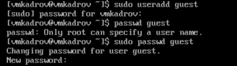
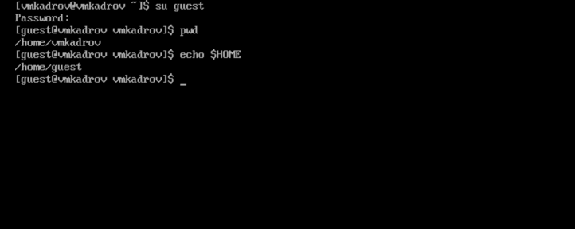
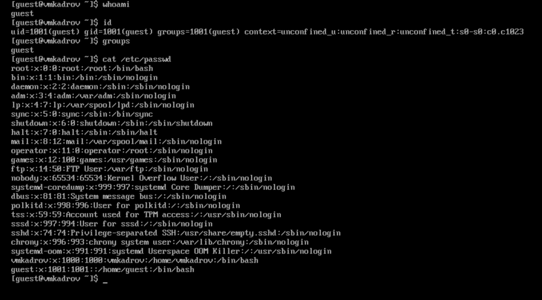
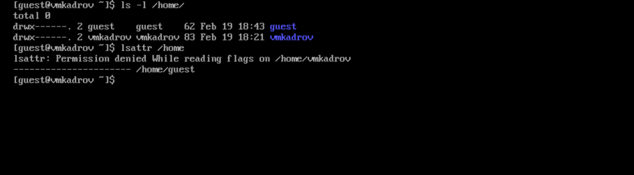

---
## Front matter
lang: ru-RU
title: Лабораторная работа №2
subtitle: Дискреционное разграничение прав в Linux. Основные атрибуты"Анализ файловой системы Linux. Команды для работы с файлами и каталогами
author:
  - Кадров В.М.
institute:
  - Российский университет дружбы народов, Москва, Россия
date: 27 февраля 2024

## i18n babel
babel-lang: russian
babel-otherlangs: english

sansfont: PT Sans

## Formatting pdf
toc: false
toc-title: Содержание
slide_level: 2
aspectratio: 169
section-titles: true
theme: metropolis
header-includes:
 - \metroset{progressbar=frametitle,sectionpage=progressbar,numbering=fraction}
 - '\makeatletter'
 - '\beamer@ignorenonframefalse'
 - '\makeatother'
---
# Задание

1. Создание нового пользователя
2. Авторизация и проверка начальных значений
3. Просмотр файла /etc/passwd
4. Атрибуты /home
5. Эксперименты с атрибутами

# Теоретическое введение

Дискреционное (избирательное, контролируемое) разграничение доступа — управление доступом субъектов к объектам базируется на том, что пользователи в том или ином объеме могут управлять настройками политик безопасности. Наиболее популярной реализацией дискреционной модели является модель, которая реализует ограничение доступа к файлам и объектам межпроцессной коммуникации в обычных пользовательских представителях семейств операционных систем Unix и Windows. В этих реализациях пользователь может произвольно изменить права доступа к файлу, который он создал, например, сделать его общедоступным.

# Выполнение лабораторной работы

## Создание нового пользователя

Создадим пользователя *guest* при помощи команды **useadd**.

{ #fig:001 width=100% }

## Авторизация и проверка начальных значений
Проверим директорию, в которой находимся и домашнюю директорию нового пользователя через *$HOME*.

{ #fig:002 width=100% }

## Просмотр файла /etc/passwd

Прочитаем файл */etc/passwd* и найдем там нового пользователя.

{ #fig:004 width=100% }

## Атрибуты /home

Используем **lsattr** для проверки атрибутов доступа и расширенных атрибутов в */home*.

{ #fig:005 width=100% }

# Выводы

В ходе лабораторной работы были получены практические навыкы работы в консоли с атрибутами файлов, закреплены теоретические основы дискреционного разграничения доступа в современных системах с открытым кодом на базе ОС Linux.