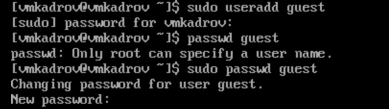
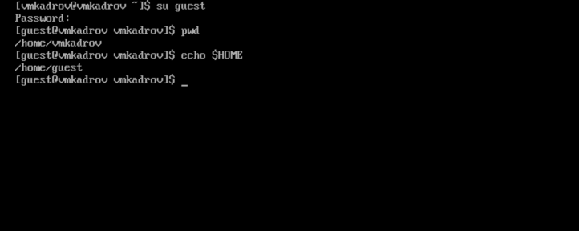
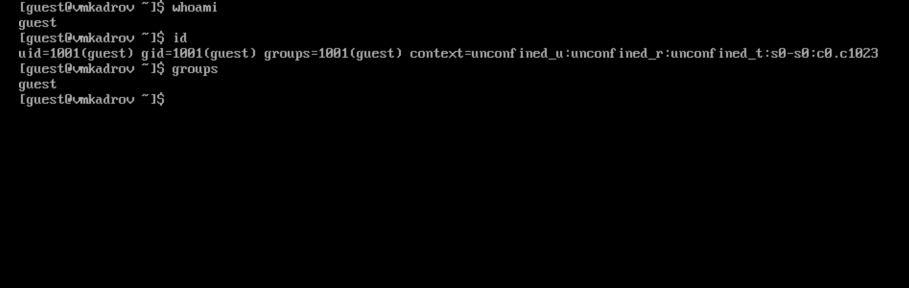
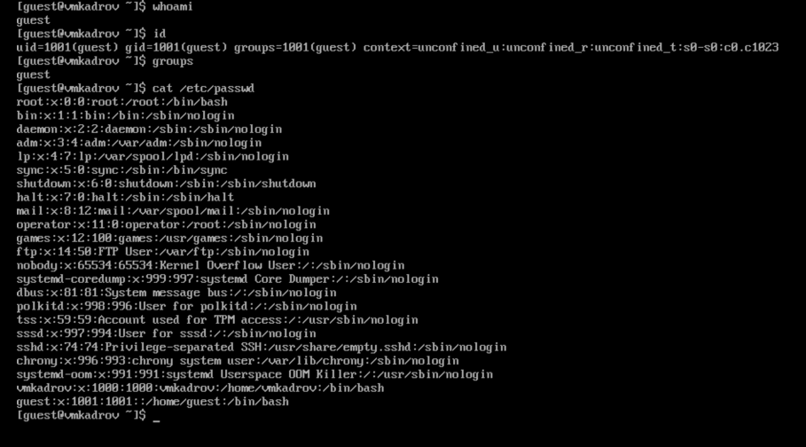
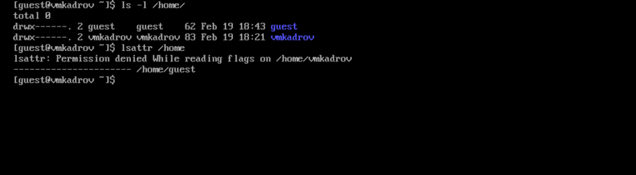
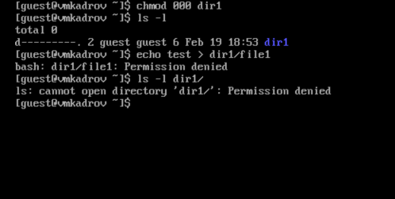
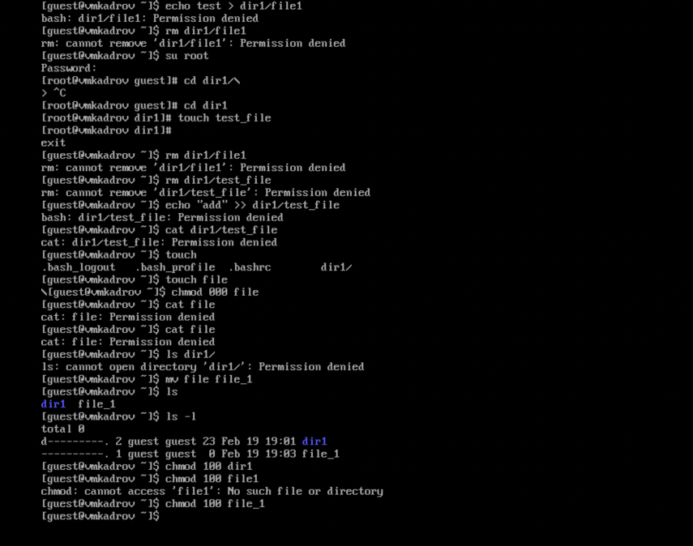

---
## Front matter
title: "Лабораторная работа №2"
subtitle: "Дискреционное разграничение прав в Linux. Основные атрибуты"
author: "Кадров Виктор Максимович"

## Generic otions
lang: ru-RU
toc-title: "Содержание"

## Bibliography
bibliography: bib/cite.bib
csl: pandoc/csl/gost-r-7-0-5-2008-numeric.csl

## Pdf output format
toc: true # Table of contents
toc-depth: 2
lof: true # List of figures
lot: false # List of tables
fontsize: 12pt
linestretch: 1.5
papersize: a4
documentclass: scrreprt
## I18n polyglossia
polyglossia-lang:
  name: russian
  options:
	- spelling=modern
	- babelshorthands=true
polyglossia-otherlangs:
  name: english
## I18n babel
babel-lang: russian
babel-otherlangs: english
## Fonts
mainfont: PT Serif
romanfont: PT Serif
sansfont: PT Sans
monofont: PT Mono
mainfontoptions: Ligatures=TeX
romanfontoptions: Ligatures=TeX
sansfontoptions: Ligatures=TeX,Scale=MatchLowercase
monofontoptions: Scale=MatchLowercase,Scale=0.9
## Biblatex
biblatex: true
biblio-style: "gost-numeric"
biblatexoptions:
  - parentracker=true
  - backend=biber
  - hyperref=auto
  - language=auto
  - autolang=other*
  - citestyle=gost-numeric
## Pandoc-crossref LaTeX customization
figureTitle: "Рис."
tableTitle: "Таблица"
listingTitle: "Листинг"
lofTitle: "Список иллюстраций"
lotTitle: "Список таблиц"
lolTitle: "Листинги"
## Misc options
indent: true
header-includes:
  - \usepackage{indentfirst}
  - \usepackage{float} # keep figures where there are in the text
  - \floatplacement{figure}{H} # keep figures where there are in the text
---

# Цель работы

Получение практических навыков работы в консоли с атрибутами файлов, закрепление теоретических основ дискреционного разграничения доступа в современных системах с открытым кодом на базе ОС Linux

# Задание

1. Создание нового пользователя
2. Авторизация и проверка начальных значений
3. Просмотр файла /etc/passwd
4. Атрибуты /home
5. Эксперименты с атрибутами

# Теоретическое введение

Дискреционное (избирательное, контролируемое) разграничение доступа — управление доступом субъектов к объектам базируется на том, что пользователи в том или ином объеме могут управлять настройками политик безопасности. Наиболее популярной реализацией дискреционной модели является модель, которая реализует ограничение доступа к файлам и объектам межпроцессной коммуникации в обычных пользовательских представителях семейств операционных систем Unix и Windows. В этих реализациях пользователь может произвольно изменить права доступа к файлу, который он создал, например, сделать его общедоступным.

# Выполнение лабораторной работы

## Создание нового пользователя

Создадим пользователя *guest* при помощи команды **useadd** (рис. [-@fig:001]).

{ #fig:001 width=100% }

## Авторизация и проверка начальных значений
Проверим директорию, в которой находимся и домашнюю директорию нового пользователя через *$HOME* (рис. [-@fig:002]).

{ #fig:002 width=100% }

{ #fig:003 width=100% }

## Просмотр файла /etc/passwd

Прочитаем файл */etc/passwd* и найдем там нового пользователя.

{ #fig:004 width=100% }

## Атрибуты /home

Используем **lsattr** для проверки атрибутов доступа и расширенных атрибутов в */home* (рис. [-@fig:005]).

{ #fig:005 width=100% }

## Эксперименты с атрибутами

Попробуем различные значения атрибутов доступа и запишем результаты в таблицу. Например, установим *000* на *./dir1* (рис. [-@fig:006]) и произведем различные действия (рис. [-@fig:007]).

{ #fig:006 width=100% }

{ #fig:007 width=100% }

|Права директории|Права файла | Создание файла | Удаление файла| Запись в файл | Чтение файла| Смена директории  | Просмотр файлов в директории |  Переименование файла | Смена атрибутов файла |
|-|-|-|-|-|-|-|-|-|-|
|000|000|-|+|-|-|-|-|+|+|
|100|100|-|+|-|-|-|+|+|+|
|200|200|-|+|+|-|-|-|+|+|
|300|300|-|+|+|-|+|-|+|+|
|400|400|-|+|-|+|-|+|+|+|
|500|500|-|+|-|+|+|+|+|+|
|600|600|-|+|+|+|-|+|+|+|
|700|700|+|+|+|+|+|+|+|+|

|Операция| Минимальные права на директорию | Минимальные права на файл|
|-|-|-|
|Создание файла|200|200|
|Удаление файла|000|000|
|Чтение файла|400|400|
|Запись в файл|200|200|
|Переименование файла|000|000|
|Создание поддиректории|700|700|
|Удаление поддиректории|700|700|

# Выводы

В ходе лабораторной работы были получены практические навыкы работы в консоли с атрибутами файлов, закреплены теоретические основы дискреционного разграничения доступа в современных системах с открытым кодом на базе ОС Linux.