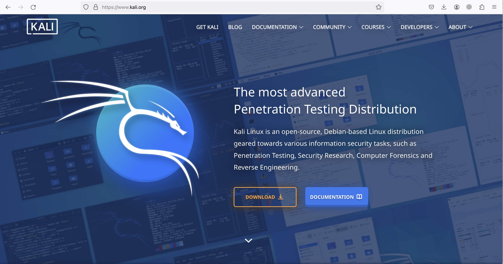
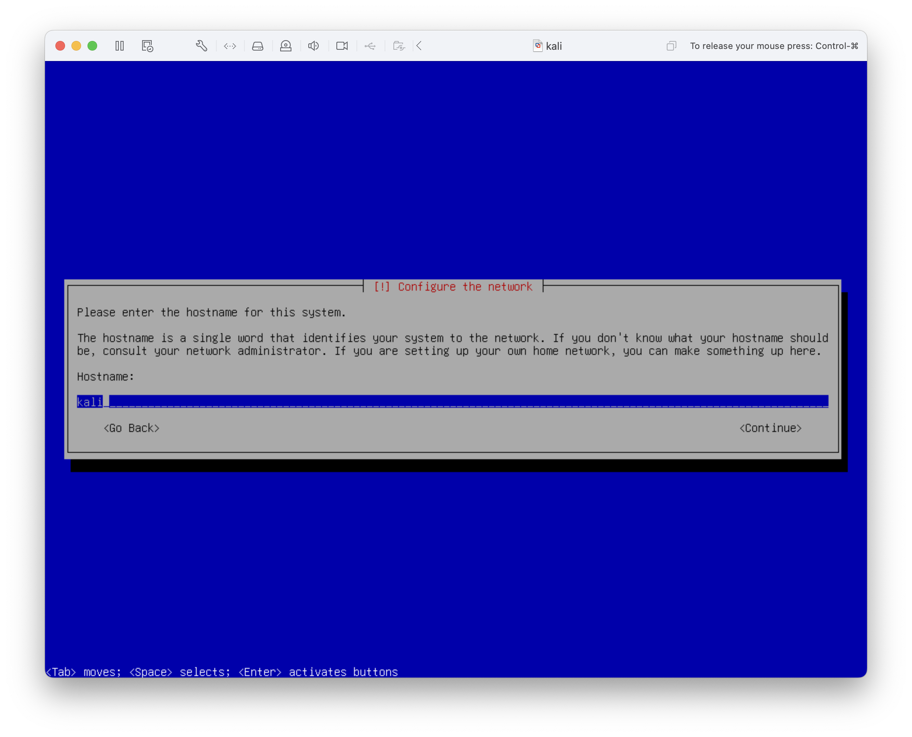
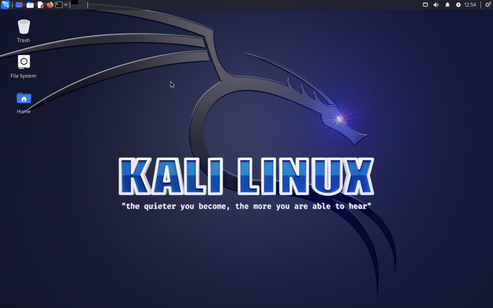

---
## Front matter
lang: ru-RU
title: Индивидуальный проект. Этап №1
subtitle: Установка Kali Linux
author:
  - Кадров В.М.
institute:
  - Российский университет дружбы народов, Москва, Россия
date: 27 февраля 2024

## i18n babel
babel-lang: russian
babel-otherlangs: english

sansfont: PT Sans

## Formatting pdf
toc: false
toc-title: Содержание
slide_level: 2
aspectratio: 169
section-titles: true
theme: metropolis
header-includes:
 - \metroset{progressbar=frametitle,sectionpage=progressbar,numbering=fraction}
 - '\makeatletter'
 - '\beamer@ignorenonframefalse'
 - '\makeatother'
---

# Цель работы

Научиться основным способам тестирования веб-приложений.

# Задание

1. Скачивание дистрибутива
2. Установка системы
3. Проверка возможностей

# Выполнение лабораторной работы

## Скачивание дистрибутива

Заходим на официальный сайт и скачиваем установочный образ.

{ #fig:001 width=100% }

## Установка системы

Устанавливаем систему на виртуальный диск.

{ #fig:002 width=100% }

## Проверка возможностей

Запускаем систему.

{ #fig:003 width=100% }

# Выводы

В ходе лабораторной работы была установлена Kali Linux.