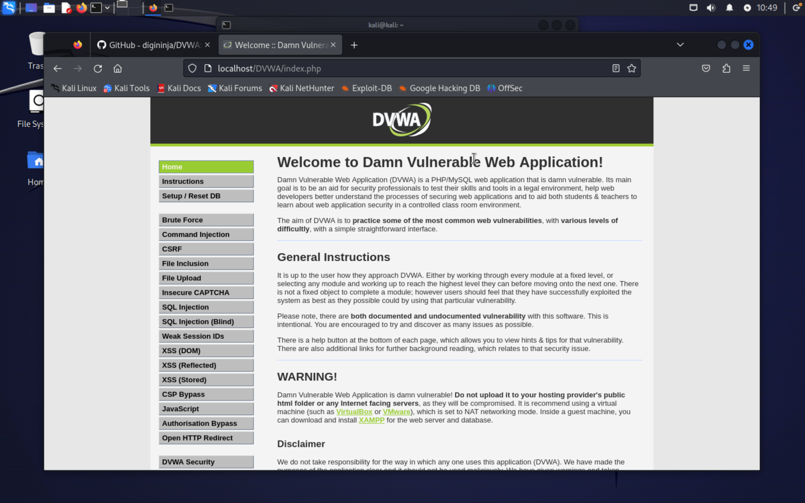
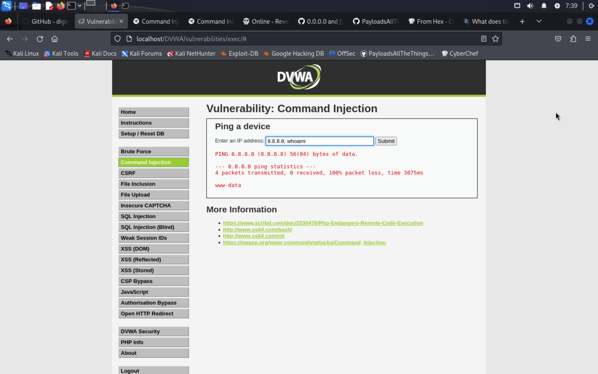

---
## Front matter
lang: ru-RU
title: Индивидуальный проект. Этап DVWA
author:
  - Кадров В.М.
institute:
  - Российский университет дружбы народов, Москва, Россия
date: 16 марта 2024

## i18n babel
babel-lang: russian
babel-otherlangs: english

sansfont: PT Sans

## Formatting pdf
toc: false
toc-title: Содержание
slide_level: 2
aspectratio: 169
section-titles: true
theme: metropolis
header-includes:
 - \metroset{progressbar=frametitle,sectionpage=progressbar,numbering=fraction}
 - '\makeatletter'
 - '\beamer@ignorenonframefalse'
 - '\makeatother'
---

# Цель работы

Установить уязвимый веб-сервер DVWA.

# Задание

1. Установка приложения
2. Тестирование уязвимостей

# Выполнение лабораторной работы

## Установка приложения

Заходим на github, скачиваем себе установочный скрипт и выполняем его. В итоге на виртуальную машину устанавливается уязвимый веб-сервер.

{ #fig:001 width=100% }

## Тестирование уязвимостей

Ищем веб-уязвимости.

{ #fig:002 width=100% }

# Выводы

В ходе лабораторной работы был установлен уязвимый веб-сервер DVWA.