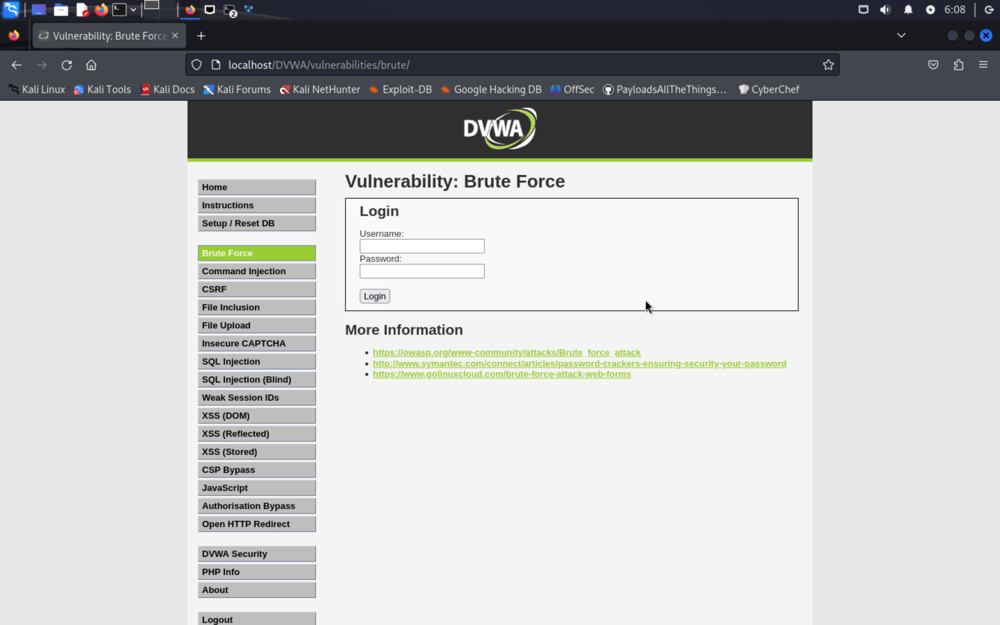
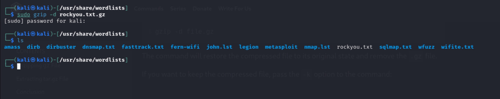
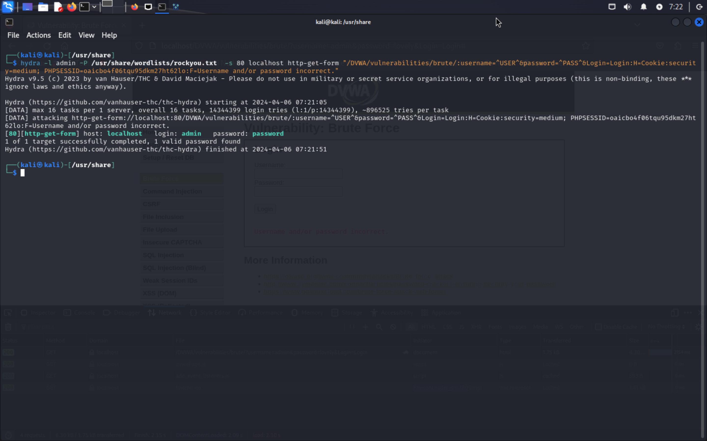
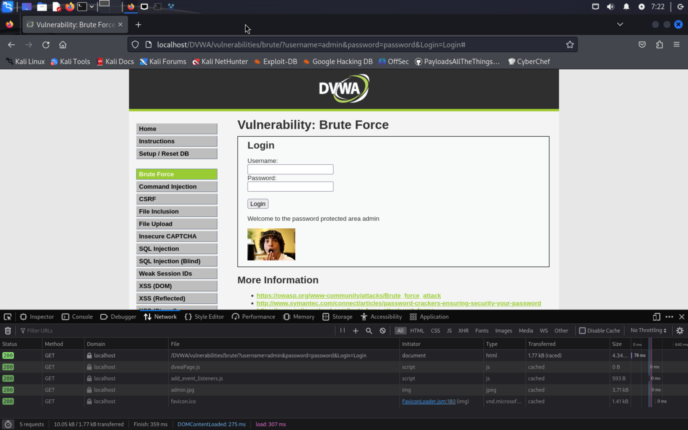

---
## Front matter
lang: ru-RU
title: Индивидуальный проект. Этап №3
author:
  - Кадров В.М.
institute:
  - Российский университет дружбы народов, Москва, Россия
date: 6 апреля 2024

## i18n babel
babel-lang: russian
babel-otherlangs: english

sansfont: PT Sans

## Formatting pdf
toc: false
toc-title: Содержание
slide_level: 2
aspectratio: 169
section-titles: true
theme: metropolis
header-includes:
 - \metroset{progressbar=frametitle,sectionpage=progressbar,numbering=fraction}
 - '\makeatletter'
 - '\beamer@ignorenonframefalse'
 - '\makeatother'
---

# Цель работы

Научиться пользоваться утилитой Hydra.

# Задание

1. Просмотр уязвимой формы
2. Поиск словаря с паролями
3. Использование Hydra
4. Проверка результатов

# Выполнение лабораторной работы

## Просмотр уязвимой формы

Изучаем уязвимую веб-форму, чтобы узнать параметры запроса и передать в программу. Здесь мы узнаем, что выполняется GET-запрос с двумя параметрами. Также через консоль разработчика узнаем параметры cookie (ID сессии и уровень защищенности DVWA)

{ #fig:001 width=100% }

## Поиск словаря с паролями

Выбираем один из стандартных словарей и распаковываем его.

{ #fig:002 width=100% }

## Использование Hydra

Запускаем программу с нужными параметрами и после некоторого времени видим одну подходящую пару логин-пароль.

{ #fig:003 width=100% }

## Проверка результатов

Проверяем, что эта пара действительно подходит.

{ #fig:004 width=100% }

# Выводы

В ходе лабораторной работы была изучена программа Hydra.
